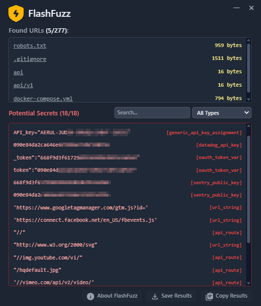
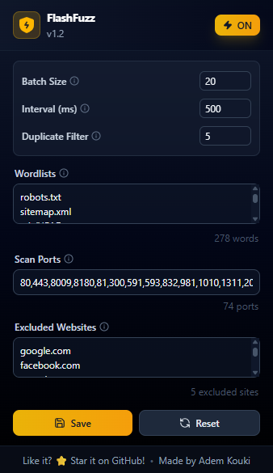

  

 <h1 align="center">FlashFuzz</h1>
    
A Browser Extension for Quick URL Fuzzing and Secret Scanning

Fast, lightweight, and designed for security engineers who want immediate reconnaissance without leaving the browser. Quickly identify hidden endpoints and potential secrets across all open tabs.

  

## Features

- Quickly fuzz URLs in all open tabs to discover hidden endpoints.
- Use custom wordlists or built-in example lists.
- Concurrent requests with configurable batch size.
- Scan JavaScript files loaded in each tab for likely secrets (API keys, tokens, AWS keys, etc.).
- Export findings for further analysis or reporting.
- Lightweight UI for quick runs and detailed results with request/response snapshots.
- Open source and free to use.

## Demo

## Installation

## Installation

### Chrome / Chromium-based browsers (Developer / Unpacked)
1. Download the latest release from the [Releases](https://github.com/Ademking/FlashFuzz/releases) page and unzip the archive.
2. Open Chrome (or another Chromium-based browser) and navigate to `chrome://extensions/`.
3. Enable **Developer mode** using the toggle in the top-right corner.
4. Click **Load unpacked** and select the extracted extension folder.
5. The FlashFuzz icon should appear in your browser toolbar — pin it if you want quick access.
6. Click the icon to open the extension and start fuzzing!

---

### Firefox (Temporary Add-on / Developer)
1. Download the latest release from the [Releases](https://github.com/Ademking/FlashFuzz/releases) page and unzip the archive.
2. Open Firefox and navigate to `about:debugging#/runtime/this-firefox`.
3. Click **Load Temporary Add-on…** and select the downloaded zip file.
4. Click the FlashFuzz toolbar icon to open and start fuzzing.

## Usage

0. FlashFuzz must be enabled (Check the toggle in the top right corner of the extension).
1. Open the tabs you want to scan (one or many).
2. The extension will automatically run fuzzing and secret scanning on all open tabs.

## Settings

  

You can adjust settings like wordlist, batch size, and secret scanning options in the settings tab.

- Wordlist: You can use the default wordlist or provide your own custom list.
- Batch Size: Adjust the number of concurrent requests sent during fuzzing. (Default: 10 requests)
- Interval between requests: Set a delay between each batch of requests to avoid overwhelming the target server (Default: 500ms).
- Duplicate Response Filter: Enable this to filter out duplicate responses based on content length. This helps reduce noise in the results. (Default: 5 requests)

## FAQ

**Q: Is FlashFuzz free to use?**
A: Yes, FlashFuzz is completely free and open source.

**Q: Can I use my own wordlist?**
A: Yes, you can provide your own custom wordlist in the settings.

**Q: Does FlashFuzz store my data?**
A: No, all processing is done locally in your browser. No data is sent to any external servers.

## Disclaimer

FlashFuzz is a tool for security testing and reconnaissance. It can generate a significant number of requests to target hosts. You must obtain explicit authorization before using FlashFuzz against any system you do not own or have permission to test. Unauthorized scanning or fuzzing may be illegal and may be considered malicious activity.

I am not responsible for any damage, disruptions, legal issues, or other consequences that arise from your use of this software. By using FlashFuzz you accept full responsibility for how you use it.

Always follow ethical guidelines and local laws. For professional engagements, use FlashFuzz only under an agreed scope and written permission.

## Contributing

Contributions are welcome! Please fork the repository and submit a pull request with your changes.

## License

This project is licensed under the MIT License. See the [LICENSE](LICENSE) file for details.
